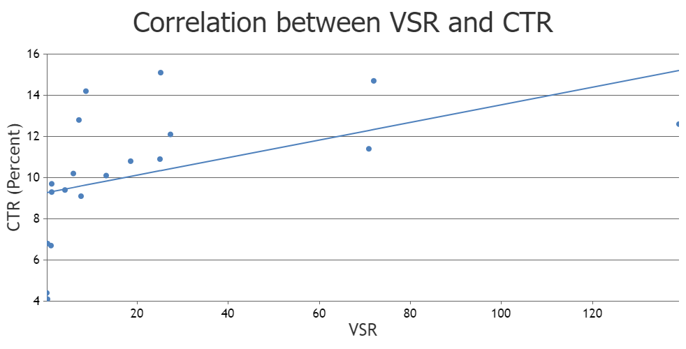

### Onym-AI
Onym-AI is an AI model that forecasts the success of a YouTube thumbnail and title pair by predicting their Viewer-to-Subscriber Ratio (VSR).

### Why VSR?
Ideally, the optimal metric for the model to predict would be the video's Click-Through Rate (CTR), as it is a direct measurement of how many viewers click on a video after seeing it. Unfortunately, analytics surrounding CTR aren't readily available to the public, making a large-scale model challenging to create — especially for individuals like myself. As an alternative, Onym-AI predicts a video's VSR; a metric that gauges how well a video performs relative to the channel's subscriber base.

### Initial Analysis and Correlation Findings
Before committing to VSR as the predictive metric, I conducted an initial analysis using data from my own YouTube channel to assess its statistical viability. The results showed a moderate positive correlation between VSR and CTR (r ≈ 0.48, p ≈ 0.036). Although this level of correlation isn't ideal, it suggests that VSR can serve as a reasonable proxy for CTR in this application.

Below is a scatter plot showing the relationship between VSR and CTR, revealing a moderately positive trendline:

Although the initial analysis is based on a limited and unrefined dataset, it provides enough evidence for me to confidently proceed with the project. I aim to further explore and refine the correlation between VSR and CTR to improve the model's predictive accuracy.

### Why is it called Onym?
I named the model "Onym-AI" after the Greek suffix "-onym," which literally means "Name." I felt it was fitting for an AI related to YouTube titles and thumbnails.

### Why create Onym?
I've had the project idea for a while. Initially, I only wanted to predict the success of a video's thumbnail. However, after watching [this video by Learn By Leo](https://www.youtube.com/watch?v=CQeh_f2zh3k), I was inspired not only to start the project but also to include the title in the prediction. The project is entirely educational and non-commercial.
